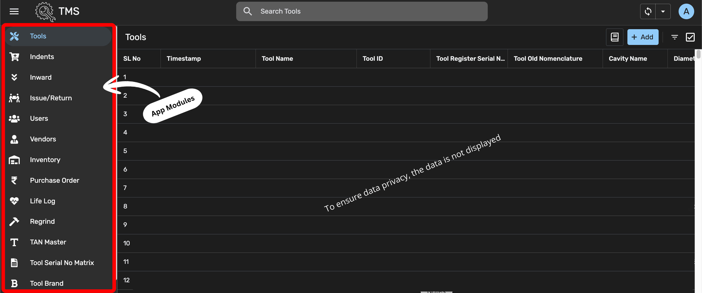

# Tool Management System

## Overview
This project is a Tool Management System built using Google AppSheet to help manufacturing companies track and manage their tools efficiently.

Many factories still track tools using spreadsheets or manual registers which leads to:
- Loss of tools
- Poor inventory visibility
- Untracked tool usage
- Difficult purchase approvals
- Lack of lifecycle tracking

This system digitizes the entire workflow and provides a centralized platform for tool tracking and management.

## Problem Statement
Manufacturing companies manage many tools used in production processes. Without a proper tracking system, companies face challenges such as:
- No visibility of tool inventory
- Difficulty tracking tool issue and return
- Lack of approval workflow for tool requests
- Poor vendor management
- No tracking of tool lifecycle events like regrinding or repairs

## Solution
The Tool Management System provides a digital platform to manage tools across their entire lifecycle.

The system allows users to:
- Maintain a centralized tool database
- Track tool movement
- Create tool indent requests
- Manage vendors and purchase orders
- Track tool lifecycle events
- Automate approval workflows through email

## Tech Stack
- Google AppSheet
- Google Sheets (backend database)
- Email Automation Workflows
- No-code application development

## System Modules

The system consists of the following modules:
- Tools – Master database of all tools
- Indents – Tool request system
- Inward – Track tool entries into inventory
- Issue / Return – Track tool movement
- Vendors – Vendor master
- Inventory – Tool stock monitoring
- Purchase Orders – Tool procurement tracking
- Life Log – Tool lifecycle history
- Regrind – Tool reconditioning tracking
